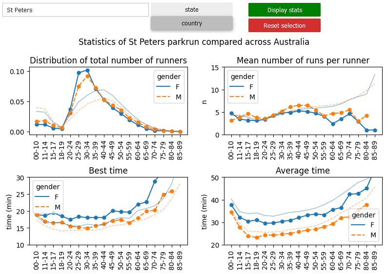
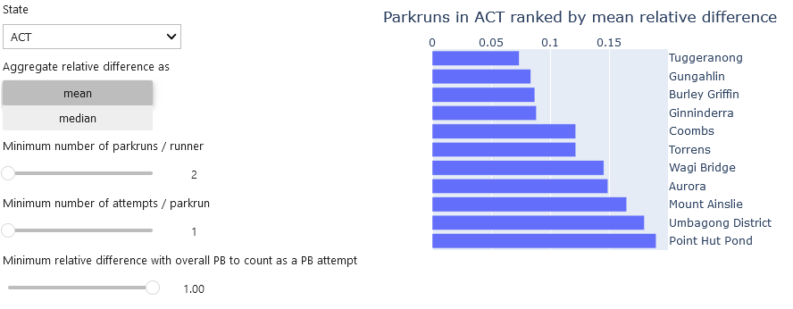

# Finding Australia's fastest parkrun
Parkrun is a free, community event where you can walk, jog, run, volunteer or spectate. Parkruns take place weekly in parks across the world. Originating in the UK, Australia's first parkrun took place https://www.parkrun.com.au/ in 2011 on the Gold Coast. Currently, there are 463 locations with weekly parkruns, which is an astonishing success to get people moving for a nonprofit organization

Events are timed and results are posted online a couple hours after. With so many events to choose from, it is a natural question to ask if we can find the fastest parkrun, that is, the parkrun with the flattest course without sharp turns, fully on asphalt, solid competition but not overcrowded, and decent weather (no wind, not too hot etc.). Inspired by Tim Grose's analysis of retrieving UK's fastest parkruns https://www.thepowerof10.info/content/itemdisplay.aspx?itemid=1702, we attempt to find Australia's fastest parkruns.

## Methods
First, one could simply compute the average of all times ever ran at any course and compare. This, however, mainly indicates whether the parkrun is mainly attended by elite runners or by recreational runners. We thus have to find a way to remove the distribution-dependence.

Tim Grose ranks parkruns by their Standard Scratch Score, a term used in golf to compare the difficulty of courses. The 'handicap' between players is the difference between their PBs. Events are scored relative to how far runners perform away from their best times throughout the year.

Rather than considering the times of all parkruns ever ran, we only consider personal bests recorded per age-group and event, and try to find the parkrun where participants have ran on average the time closest to their PB. 

This solves two problems at once:
- it is challenging (and honestly overkill) to retrieve this mass of data
- not every runner gives an all-out effort at every event. 

We rank parkruns within a state by the mean or median relative difference. We can add additional constraints on how many events / attempts / effort level to modulate results.

## Results
|  | 
|:--:| 
| Visualizing parkrun statistics compared to state-wide or country-wide |

|  | 
|:--:| 
| Ranking parkruns from fast to slow per state |

## Disclaimer
We cannot say which parkrun ranks as the single fastest, and it is honestly not a particularly relevant question. Conditions may vary, and some parkruns will experience a cooler day with less breeze. If it is business as usual in the tropics, extremely hot and humid, the average time won't be fast, while in best conditions they may be. We pick up some of that signal, because in these conditions runners will usually set their PBs, but not all runners get the chance to run this particular parkrun in ideal circumstances.

## Discussion
In the notebook 04_analyze.ipynb, we work through developing the methodology. The gist is: many parkruns are fast and some are notoriously slow. The beauty of the chosen metric is that if you have set a PB at a particular slow course, if another course is considered 2% faster, you may be able to push your PB 2% lower by running at this particular fast course next!

### Validation
The Australian and world records that have been set over the last two years demonstrates that this analysis is not about the course that is ranked the fastest, but whether the course is among the fastest. Couple such a course to an elite runner who has a good day in ideal conditions and you may be in for a surprise!

Australian women setting world records:
- 15:45 in Parramatta, NSW by Lauren Reid https://www.sportingnews.com/au/athletics/news/sydney-runner-lauren-reid-breaks-parkrun-world-record-at-parramatta/1932730uw7wlc19ozelhxk3mj2
- 15:38 in Lochiel, SA by Caitlin Adams https://www.abc.net.au/news/2022-08-27/what-its-like-to-hold-the-australian-parkrun-record/101342044
- 15:25 in Aldinga Beach, SA by Izzi Batt-Doyle https://runningmagazine.ca/the-scene/australian-olympian-breaks-womens-parkrun-world-record/

Recent male Australian records 
- 14:02 in Kedron, QLD by Jude Thomas https://blog.parkrun.com/au/2021/06/24/jude-thomas-sets-new-australian-parkrun-record/
- 13:53 in Launceston, TAS by James Hansen https://blog.parkrun.com/au/2022/08/26/jameshansen/

Note that they are all different parkruns! One can run very fast times under many different conditions in many different states. So we cannot say which one of these parkruns is faster than the other overall. We can say these parkruns are among the fastest in NSW, SA, QLD and TAS. Indeed, if we look at the analysis in notebook 06, all of them except for Aldinga Beach rank among the top 10 in the state. Actually, Aldinga Beach is actually a top 20 course. This means that according to this analysis, runners have set their PBs almost 1% faster at Lochiel than at Aldinga Beach. So Izzi Batt-Doyle could have gone even faster on that particular day - if conditions were average that day at both courses, and if competition was equivalent, and if this signal also hold up for elite runners.

Another example of external validation is Rhodes parkrun. It comes out as the top5-top10 fastest ranked course in NSW. It is also considered a fast course by runners, see https://www.youtube.com/watch?v=xjet33Fj07I for a race preview and https://www.youtube.com/watch?v=35lvMp5DHQ4 or https://www.youtube.com/watch?v=0zeMHxKJN48 for commentary by local hero Sota Maehara on his solid 15:40 PB. 

### Issues
A typical issue with this methodology can be seen at my home parkrun in St Peters. It is known for a long, steep hill after 1km, as well as a profile that is never flat, and finishing off with a gnarly, sloping uphill. You would think that it is a slow course for that reason. It is not! The course is consistently around 100m short according to my Strava, probably because I don't run at the very left of the road the entire run (and I am not the only one). So I do better than I should do at this course compared to other courses, but I rank evenly compared to others. Finally, when I ran my parkrun PB only a few weeks back into training, the course was even shorter because the start was moved from the field, which was one large puddle, onto the path. Ideal PB time, but an issue with the methodology.

Also, supposedly, Curl Curl parkrun in NSW is a course where it is natural to cut a few corners, and so parkruns are fast as a result. Again, having a comparison of expected rank, rather than expected time, would be better.

### Finally
I apologize if your local parkrun is missing, it may never have been included because it has seen fewer than 100 people set agegroup PBs in total or due to the constraint with who to include in ranking parkruns. This is a necessity because there is too much noise with few people included. Finally, the parkrun could actually be appear me in the wrong state. Ping me if you notice this.

## Code
The code is organized as follows:
- 01_scrape: scrape data from parkrun.com.au. This code takes a while to run (~10-12 hours) since there is data to pull across more than 8000 webpages. On every page we find the PBs of runners to have ever recorded a PB in a particular agegroup at a particular parkrun. One does not have to rerun this notebook, since the processed and cleaned data is already stored on Github.
- 02_process: combine all individual parkruns into a single dataframe
- 03_clean: remove participants with shared name and gender if the maximum age between datapoints exceeds the time that parkrun has existed for (certainly not the same person so could be very different PB adding noise to the data) and parkruns with less than 100 PBs, which is too few for reliable statistics
- 04_analyze: analyze methods on how to best rank parkruns
- 05_visualize_distributions: visualize data grouped per parkrun across a few dimensions
- 06_rank_parkruns: a widget to choose parameters to find the fastest parkrun in a state

## TODO
- deploy notebooks 05_visualize_distributions / 06_rank_parkruns using the free MyBinder.
- build graph to further work out relationship between pairs of fast / slow parkruns
- fix retrieving states from parkrun names
